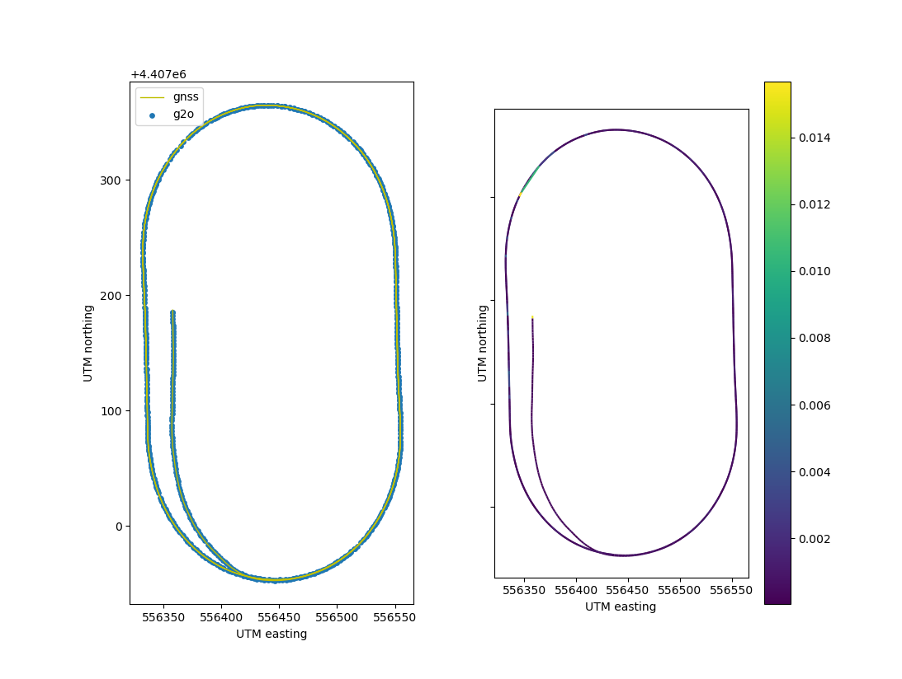

# g2o_pos_eval
This python script prints a .g2o pose path and calculates the euclidean distance to a "ground truth" GNSS signal

## Run
```bash
python3 pos_eval.py <path-g2o> <path-zero_utm> <path-gnss> <plotting_dimension>
```
testdata can be found in 'data/'




